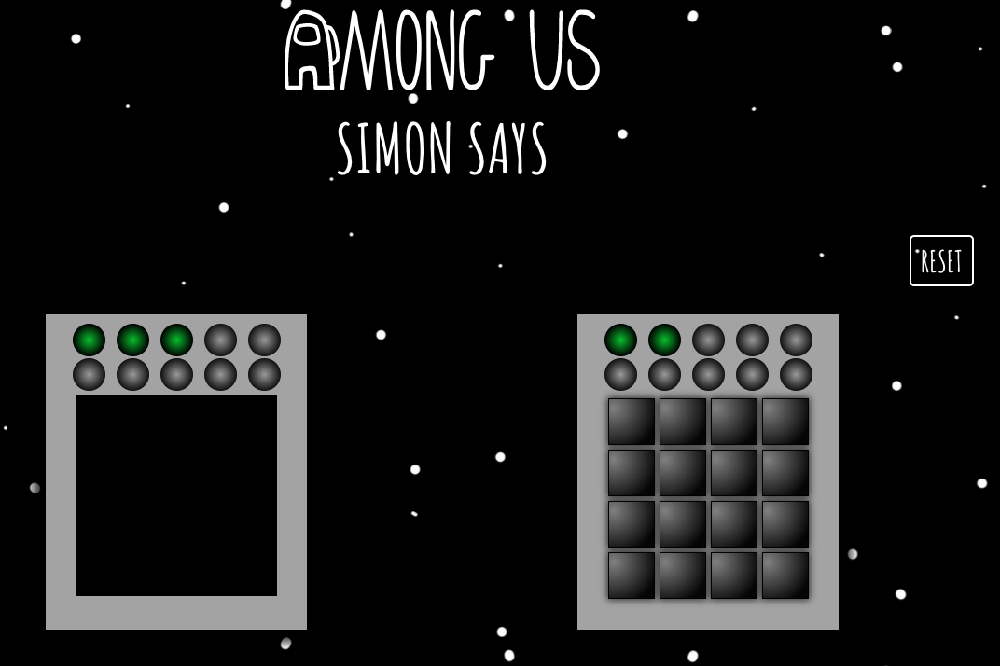

# Among us Simon Says

The project is an attempt to create a mini game with Among Us - Simon Says.
The game has changed the rules - you can choose the number of rounds from 1 to 10. In addition, in case of a mistake you are retracted to the last correct combination.

Project was bootstrapped with [Create React App](https://github.com/facebook/create-react-app) with template Typescript.

Check live demo at [https://derekqq.github.io/among-us-simon-says/](https://derekqq.github.io/among-us-simon-says/).



#### App structure:

- components (react components)
- pages (react components that build app pages)
- slices (Redux Toolkit slices)
- helpers(helpers function for fetch data)
- hooks (custom hooks)
- images (images)
- theme (global styles)

#### To run on local machine

```javascript
yarn;
```

local:

```javascript
yarn start
```

test:

```javascript
yarn test
```
